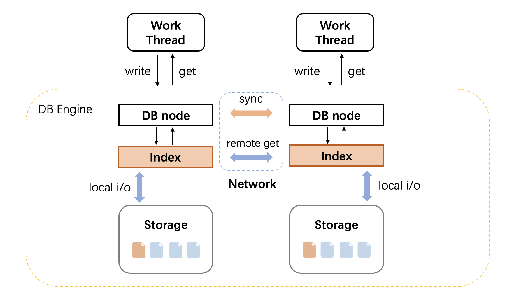

# 概览



我们的实现中主要包含四个部分，分别是storage、index、network和engine(DB)。
- storage：负责管理数据的写入和存取，以及数据的崩溃恢复。
- index: 用来管理内存中的索引的组织形势，负责索引的读和写。
- network: 负责节点之间的数据读取、数据同步。
- engine(DB): 提供数据的读取写入接口，组织系统中各个模块，包含get/write执行过程中的逻辑。 
# 1. storage
## 1.1 相关文件
- `inc/store/NvmStoreV2.h`
## 1.2 介绍
> 数据的存储分成两个区域，Normal区域和Random区域，Normal和Random区各自是一块连续的pmem地址空间。Normal区存储的数据按照id值作为偏移地址，只能存固定范围的id，比如[0, 2亿)。id超出Normal区的数据存储在Random区域。
### 1.2.1 Normal区数据格式
- `mmem_meta_file`: 记录meta信息，比如pmem_data_file的起始偏移，比如slot_0的id可能是0或2e或4e或6e。
```c++
/**
 * ---------------------------
 * | offset  | .. unused ..
 * ---------------------------
 * | uint_64 | .. unused ..
 * ---------------------------
 */
```
- `mmem_data_file`: salary写在mmem_data_file上，mmem_data数据写在mmap上，可以在系统崩溃时不丢失数据。崩溃恢复时借助于salary判断数据是否提交。
```c++

/**
 * salary=0xFFFF FFFF FFFF FFFF表示该数据无效，否则表示该数据已提交
 * -------------------------------------------------------------------------
 * | slot_0 (id = 0+off))  | slot_1 (id = 1+off))  | slot_2 (id = 2+off))  | 
 * -------------------------------------------------------------------------
 * |        salary         |        salary         |        salary         | 
 * -------------------------------------------------------------------------
 */
```
- `pmem_data_file`: user_id和name写在pmem_data_file上
```c++
/**
 * ---------------------------------------------------------------------
 * | slot_0 (id = 0+off) | slot_1 (id = 1+off) | slot_2 (id = 2+off) | 
 * ---------------------------------------------------------------------
 * |   (user_id, name)   |   (user_id, name)   |   (user_id, name)   |
 * ---------------------------------------------------------------------
 * 
 */
```
### 1.2.2 Random区数据格式
- `pmem_random_file`: 对pmem_random_file上的数据划分桶，不同的线程id独立写时，append数据进属于自己的桶。通过一个commit_cnt，标记每个桶已经提交的数据个数进行崩溃恢复。
```c++
/**
 * pmem_random_file 上数据存储commit_cnt和append完整记录，每个写入线程各有一个。
 * --------------------------------------------------------------------
 * |   8 bytes  | slot_0            |        slot_1       | ... | ... 
 * --------------------------------------------------------------------
 * | commit_cnt | tuple(272bytes)   |   tuple(272bytes)   | ... | ... 
 * ---------------------------------------------------------------------
 * 
 */
```
# 2. index
## 2.1 相关文件
- `inc/index/MemIndex.h`
- `inc/tools/MyStrHashMap.h`
## 2.2 介绍
> 我们分别对`id`、`userid`和`salary`字段建立了哈希索引。
# 2.2.1 id索引
对于Normal区的数据，由于写入postion是由id决定，因此无需建立索引，对于Random区的数据，建立索引。其中hash_key为字符串id，hash_value的值为数据在存储区域中的位置position。其中postion的最高位0或1标该位置是在Normal数据区还是Random数据区。
# 2.2.2 userid索引
为了降低userid索引在内存中占用的空间，将userid进行哈希，得到hashcode作为userid的唯一性标识(hashcode)。
其中hash_key为字符串hashcode，hash_value的值为数据在存储区域中的位置position。其中postion的最高位0或1标该位置是在Normal数据区还是Random数据区。
# 2.2.3 salary索引
salary由于可能存在重复值，因此在普通的hashmap的基础上，即使命中了数据，依然需要遍历碰撞处理区的所有数据。其中hash_key为字符串salary，hash_value的值为数据在存储区域中的位置position。该position的组织较为复杂。如下
```c++
/**
 * value的存储格式(uint32_t),从左到右，对应高位到低位
 * -------------------------------------------------------------------------------------------------------------------------
 * |            第31位             |                         第29~30位                     |   第28位  | 第0~27位            |
 * -------------------------------------------------------------------------------------------------------------------------
 * | 0: normal数据区，1: rand数据区 | 00: 对应本地, 01、10、11: 对应远端是哪一个peer_idx(1~3) |   未使用  | position(0 ~ 2亿-1) |
 * -------------------------------------------------------------------------------------------------------------------------
*/
```
# 2.3 冲突解决方式
> 我们为每一个hashmap添加一个公共的碰撞处理区域(Pmem)，当发生冲突时，将数据插入公共的碰撞处理区域中。读时，遍历公共的碰撞处理区域的数据。
# 3. network
# 3.1 相关代码
- `inc/network/MySocket/MyClient.h`
- `inc/network/MySocket/MyServer.h`
- `inc/network/MySocket/MySocket.h`
- `inc/network/MySocket/Group.h`
## 3.2 介绍
> 网络模块，我们自己使用socket实现进程间的通信。服务端对于每一个连接，创建一个线程用来处理。对于每个节点，初始化时，分别向3个节点建立3*50(peer数 * 前台线程数)个连接。对于超出50个线程的情况，动态添加建立新的连接。
## 3.3 协议介绍
`get`包含3种请求类型,分别对应`where id/userid/salary`，以及2种同步类型`sync_init`和`sync_deint`，以及用来同步数据的`send_salary`。如下
```c++
enum class RequestType : uint8_t {
    WHERE_ID, // default 0
    WHERE_USERID,
    WHERE_NAME,
    WHERE_SALARY,
    SYNC_INIT,
    SYNC_DEINIT,
    SEND_SALARY,
    NONE
};
```
对于get请求的响应数据包括数据长度加实际数据内容。如下:
```c++
struct Package {
  int32_t size = 0;
  char data[PACKAGE_DATA_SIZE];
};
```
# 4. engine(DB)
# 4.1 相关代码
- `inc/NvmDB.h`
# 4.2 介绍
NvmDB 模块组织系统的各个模块，并对外提供init、deinit、put和read接口。并且启动后台线程用来向其他节点同步本地的id+salary数据。
## 4.2.1 init阶段
该阶段需要初始化存储，replay之前的数据，并将数据插入到索引中，之后启动网络server，之后启动client向其他节点建立连接。根据题意，需要4个节点同时建立连接，才能结束init阶段。因此，当确定其他节点都成功建立了连接之后，等待(足够长的时间）3s，再结束init阶段。
## 4.2.2 deinit阶段
根据题意，需要4个节点同时deinit时，才可以顺利退出，因此，和init阶段同理，需要4个节点同时发起了init请求时，等待（足够长的时间)3s，再结束init阶段。
## 4.2.1 put接口
对于put请求，主要路径包括: 写存储层->写索引。写存储层时，根据id的值判断写Normal区域还是Random区域。
## 4.2.2 get接口
对于get请求，处理较为复杂，首先包含了9(3*3)种情况，下面分别说明。（注：当数据命中之后`->`之后的操作不再执行)
- `select userid from id`
> (同步完成前)本地读+广播远程读; (同步完成后)本地读->定位id对应的peer直接远程读该peer
- `select name from id`
> (同步完成前)本地读->远程读; (同步完成后)本地读->定位id对应的peer直接远程读该peer
- `select salary from id` 
> (同步完成前)本地读->远程读; (同步完成后)本地读
- `select id where userid` 
> 本地读->广播远程读
- `select name where userid` 
> 本地读->广播远程读
- `select salary where userid` 
> 本地读->广播远程读
- `select id where salary` 
> (同步完成前)本地读+广播远程读，(同步完成后)本地读
- `select userid where salary` 
> (同步完成前)本地读+广播远程读，(同步完成后)本地读->定位id对应的peer直接远程读该peer
- `select name where salary` 
> (同步完成前)本地读+广播远程读，(同步完成后)本地读->定位id对应的peer直接远程读该peer
